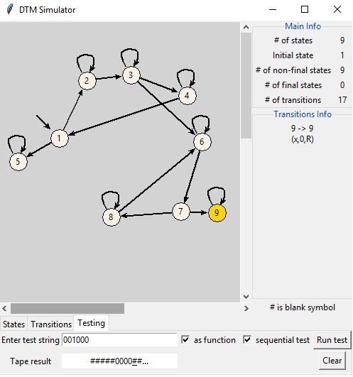

# DTM Simulator

A tool that can help design and test a deterministic Turing machine.

## Requirements

- Python 3
- Tkinter
  - on Linux, `sudo apt-get install python3-tk` helped
  - most likely already built-in with Python on Windows

## Usage

Go to [releases](https://github.com/clovenski/dtm-simulator/releases) for an easier, portable executable of DTM Simulator.

Python 3 and Tkinter are **not** required in this case. Simply run the unzipped executable to start the application.

### From source:

Download or clone the repository
```
git clone https://github.com/clovenski/dtm-simulator.git
```

Run the application
```
./src/main.py
# OR
python3 src/main.py # Linux
python src\main.py  # Windows
```

## Notes

Typical use case would be to add all the necessary states for your design, enter all of the transitions and test some string to see if your machine accepts or rejects that string. There is also a check box to test strings sequentially, as in you can visually see the current state and tape index of the machine; pressing a button to advance.

Some things to note:

- machine's blank symbol is the hash symbol, `#`

- loops between two states (two transitions to and from them) are labeled with a double-headed arrow

- remember that a configuration for a transition in a Turing machine is (*R*, *W*, *M*) where *R* is the symbol the machine reads, *W* is what the machine writes/replaces on the tape and *M* is either left or right; indicating where the machine moves to for the next input

- this application implements the *semi*-infinite tape Turing machine, as in only one side of the tape is infinite; thus if the index moves past the leftmost index (< 0), the machine halts and rejects the string

- be mindful when running a non-sequential test as Turing machines can enter an infinite loop; use the stop button to abort the test

- a Turing machine "as a function" does not accept/reject a string, it continues computation until it has no transition to use at its current state; thus a state being final has no effect

## Showcase



